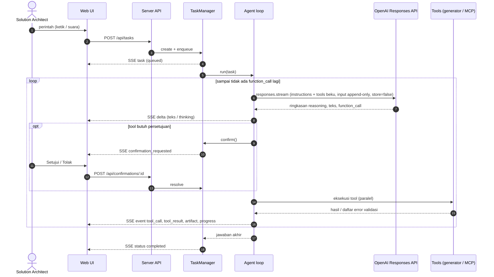

# Arsitektur SOLAR

Dokumen ini menjelaskan cara kerja internal SOLAR untuk pengembang dan reviewer.

## 1. Komponen

| Komponen | Lokasi | Tanggung jawab |
|---|---|---|
| Web UI | `apps/web` | React 19 + Vite + TypeScript. Karakter 3D yang bisa dipilih (`src/character/`: Mochi, Cocoa Kelapa, Kelinci; three.js, animasi GSAP), chat + komposer suara, monitor, pengaturan. Berkomunikasi lewat REST dan Server-Sent Events. |
| Server | `apps/server` | Express 5. `TaskManager` (antrean, status, progres, konfirmasi), agent loop OpenAI, generator + validator, `SkillStore`, `PluginStore` + `McpManager`, penyimpanan. |
| Desktop | `apps/desktop` | Electron 44. Memuat bundle server (`server.mjs`) di main process, membuka jendela ke UI lokal, mengatur izin mikrofon, mode mini, `.env` di `%APPDATA%\SOLAR`. |
| Shared | `packages/shared` | Kontrak tipe antara server dan UI (`Task`, `TaskEvent`, `Artifact`, `PluginView`, `StreamMessage`, ...). |

## 2. Alur sebuah task ("sekali proses")

### Detail agent loop (`apps/server/src/agent/agent.ts`)

- **Provider**: OpenAI Responses API lewat SDK resmi `openai` (`client.responses.stream`). Kunci: `OPENAI_API_KEY`;
  opsional `OPENAI_ORG_ID`, `OPENAI_PROJECT_ID`, `OPENAI_BASE_URL`. Client dibuat saat task pertama sehingga server tetap
  bisa start (dan UI menampilkan petunjuk) walau key belum diisi.
- **Model**: `SOLAR_MODEL` (default `gpt-6.1-sol`), `reasoning: { effort: SOLAR_EFFORT, summary: "auto" }` untuk model
  reasoning (GPT-5/6, o-series); model non-reasoning (GPT-4.1/4o, `*-chat-latest`) dipanggil tanpa parameter `reasoning`.
  `max_output_tokens` = `SOLAR_MAX_TOKENS` (default 64 000, dibatasi maksimum model) dan dinaikkan sekali ke maksimum
  model bila respons `incomplete` - pemanggilan tool yang terpotong tidak pernah dijalankan.
- **Stateless & privasi**: `store: false` + `include: ["reasoning.encrypted_content"]` - tidak ada percakapan yang disimpan
  di OpenAI; item reasoning terenkripsi dikirim balik apa adanya sehingga penalaran model tetap utuh antar giliran.
- **Penolakan / filter**: konten `refusal` atau `incomplete_details.reason = "content_filter"` dilaporkan sebagai kegagalan
  task yang jelas. Error API dipetakan ke pesan Bahasa Indonesia (key salah, `insufficient_quota`, rate limit, model tidak
  tersedia, koneksi).
- **Prompt caching**: otomatis di OpenAI untuk prefix ≥ 1024 token. `instructions` tidak berisi data volatil (tanggal & id
  task ada di pesan user pertama), daftar tool diurutkan deterministik, dan `prompt_cache_key: "solar-agent"` dipakai
  bersama oleh semua task. Token cache terlihat di monitor.
- **Input append-only**: `instructions` dan daftar tool dibekukan per task; semua item output (reasoning, pesan,
  `function_call`) dikirim kembali apa adanya diikuti `function_call_output`. Konteks percakapan sebelumnya (maks. 5 task
  dalam sesi yang sama) diringkas ke pesan pertama ("simple compaction"), sehingga tidak ada pengeditan riwayat.
- **Validasi input tool**: argumen `function_call` di-parse sebagai JSON lalu divalidasi skema zod; JSON rusak atau input
  tidak valid dikembalikan ke model sebagai `ERROR: …` agar diperbaiki di giliran berikutnya. Deskripsi tool MCP dipotong
  ke 1024 karakter (batas OpenAI).
- **Tool paralel**: `parallel_tool_calls: true`; semua `function_call` dalam satu giliran dieksekusi bersamaan.
- **Estimasi biaya**: tabel harga per model di `agent/models.ts` (termasuk tarif konteks panjang GPT-6 > 272K token);
  bisa ditimpa `SOLAR_PRICE_PER_MTOK`.
- **Batas**: `SOLAR_MAX_TURNS` giliran per task; pembatalan menghentikan stream dan menolak konfirmasi yang tertunda.

## 3. Generator & validator

| Generator | Validasi | Output |
|---|---|---|
| `generators/archimate` | Skema zod; tabel relasi ArchiMate 3.2 (`relationships.generated.ts`, dibuat dari `relationships.xml` proyek Archi via `scripts/generate-archimate-relationships.mjs`); id unik; referensi; junction (jenis relasi sama, ada masuk & keluar); view (elemen & relasi valid, kedua ujung relasi ada di view); peringatan elemen yatim/duplikat. | Exchange XML 3.1 (diuji dengan XSD resmi), SVG per view (layout per layer + urutan barycenter + routing kurva yang menghindari elemen), JSON. |
| `generators/sequence` | Participant unik & bukan kata kunci; pesan ke participant terdaftar; keseimbangan aktivasi; nesting fragment & cabang `else`; cabang tidak kosong. | Mermaid (escape entitas satu-langkah), PlantUML, SVG (layout kolom berbasis lebar label, aktivasi bertingkat, fragment bersarang), JSON. |
| `generators/techspec` | Skema zod; id FR/NFR/AD/INT/RSK/OI unik lintas bagian; referensi diagram harus SVG artefak task. | Markdown GitHub (anchor kompatibel, tabel aman), HTML siap cetak (diagram inline, Markdown disanitasi), JSON. |

Jika validasi gagal, tool mengembalikan `is_error` berisi daftar error bernomor dan **tidak menyimpan apa pun**, sehingga
model memperbaiki input lalu memanggil ulang.

## 3b. Lampiran dokumen proyek

1. UI mengunggah file (tombol klip, seret-lepas, atau tempel) ke `POST /api/attachments` - isi file mentah, maks.
   `ATTACHMENT_MAX_MB`. `AttachmentService` memvalidasi nama & ekstensi lalu memanggil `documents/extractIsolated`.
2. **Isolasi:** `extractIsolated` menjalankan ekstraksi di *worker thread* (`dist/extract-worker.mjs`, ikut terpasang di
   aplikasi desktop) dengan batas heap 1 GB, maksimal 2 ekstraksi paralel, dan batas waktu keras (batas waktu parser
   90 detik + 5 detik) - worker dihentikan bila melewatinya, sehingga file patologis tidak bisa memblokir event loop
   atau menghabiskan memori server/Electron. Saat dijalankan dari source (`npm run dev`, test) ekstraksi berjalan
   in-process.
3. **Ekstraksi** (`apps/server/src/documents`) mengenali file dari **isinya** (`%PDF-`, paket ZIP Office, kontainer OLE2),
   bukan hanya ekstensi, lalu mengubahnya menjadi **Markdown** yang menjaga struktur:
   - PDF: `unpdf` (pdf.js serverless) - baris disusun ulang dari geometri teks, penanda `<!-- page N -->`, heading dari
     ukuran huruf, peringatan untuk halaman tanpa lapisan teks (tanpa OCR).
   - Word: `mammoth` (docx → HTML) + `turndown` (HTML → Markdown) dengan aturan tabel (colspan/rowspan), daftar,
     catatan kaki dan gambar; Title + Heading N menjadi heading bertingkat; dokumen sangat besar dipotong di batas blok.
   - Excel: pembaca streaming sendiri - hanya baris yang ditampilkan yang di-parse (maks. 50 sheet, 1.000 baris ×
     50 kolom per sheet, jumlah baris sebenarnya dilaporkan), tanggal/persen sesuai format sel, nilai rumus tersimpan,
     shared strings dibaca sampai indeks tertinggi yang dipakai. Hasilnya `## Sheet: nama` + tabel.
   - PowerPoint: parser XML kecil sendiri (tanpa ekspansi entitas, kedalaman dibatasi) - slide sesuai urutan
     `sldIdLst`, `## Slide N: judul`, poin bertingkat, tabel, data grafik, SmartArt, deskripsi gambar,
     `### Speaker notes`.
   - CSV menjadi satu tabel di bawah `# <nama file>` (maks. 2.000 baris); Markdown/teks dibaca apa adanya. Teks
     dideteksi sebagai UTF-8/UTF-16, selain itu Windows-1252 (ekspor ANSI); file biner berekstensi teks ditolak.
   - Setiap bagian paket Office dibaca lewat `ZipArchive` yang membatasi byte yang **benar-benar** didekompresi (ukuran
     yang dinyatakan, ukuran aktual, total 256 MB, 10.000 entri, rasio kompresi) sehingga *zip bomb* - termasuk yang
     header-nya berbohong - ditolak sebelum memakan memori.
   - Error membawa kode (`EMPTY`, `TOO_LARGE`, `ZIP_BOMB`, `ENCRYPTED`, `CORRUPT`, `LEGACY_FORMAT`, `UNSUPPORTED`,
     `TIMEOUT`) → HTTP 413/415/422 dengan pesan Bahasa Indonesia, mis. dokumen terenkripsi atau `.doc` lama yang diberi
     ekstensi `.docx`. Hasil dibatasi 2 juta karakter; setiap pemotongan disebutkan sebagai peringatan.
4. File asli dan hasil ekstraksi disimpan di object store (`attachments/<id>/…`), metadata (`Attachment`) di repository
   (`solar_attachments` / `data/attachments/*.json`). UI menampilkan chip + pratinjau teks hasil ekstraksi.
5. `POST /api/tasks` membawa `attachmentIds` (harus satu percakapan; validasi + pembuatan task berjalan di bawah kunci
   per percakapan sehingga lampiran tidak bisa terhapus di tengahnya). Pesan pertama ke model berisi blok
   `<attached_documents>`: teks lengkap bila total ≤ 60.000 karakter, selain itu daftar + outline dan strategi baca.
6. Tool agent: `list_documents`, `read_document` (potongan berdasarkan offset, lanjut dengan `next_offset`; anggaran
   ±400.000 karakter per task karena setiap bacaan tetap ada di input model), `search_documents` (frasa, lalu semua
   kata; semua dokumen dicari secara bergiliran; mengembalikan lokasi halaman/slide/sheet terdekat). Agen hanya melihat
   dokumen yang benar-benar dikirim bersama permintaan (task ini atau task sebelumnya di percakapan yang sama).
7. Dokumen yang diunggah tetapi belum dikirim muncul lagi sebagai chip setelah reload, dan dihapus otomatis setelah 24 jam.
8. Prompt-injection: isi dokumen dibingkai sebagai data dari pengguna; tag pembingkai SOLAR di dalam teks dokumen
   dinetralkan; system prompt dan deskripsi tool melarang mengikuti instruksi di dalam dokumen. Aksi eksternal tetap tunduk
   pada aturan konfirmasi plugin.

## 4. Konfirmasi (human-in-the-loop)

- Setiap tool punya fungsi `confirmation(input)`; plugin MCP mengikuti kebijakan `never | writes | always`
  (`writes` memakai anotasi MCP `readOnlyHint`/`destructiveHint` bila ada, selain heuristik nama tool).
- `TaskManager.requestConfirmation` menyimpan `Confirmation`, mengubah status task menjadi `awaiting_confirmation`,
  memancarkan event, lalu menunggu jawaban, pembatalan, atau timeout (`CONFIRMATION_TIMEOUT_MINUTES`).
- Penolakan dikembalikan ke model sebagai `tool_result` error dengan instruksi untuk tidak mengulang.

## 5. Penyimpanan

| Data | Tanpa konfigurasi | Dengan konfigurasi |
|---|---|---|
| Task, event timeline, metadata artefak, konfirmasi, metadata lampiran | `data/tasks/*.json` + `*.events.jsonl`, `data/attachments/*.json` | Neon Postgres (`DATABASE_URL`): tabel `solar_tasks`, `solar_task_events`, `solar_artifacts`, `solar_confirmations`, `solar_attachments` (dibuat/dimigrasi otomatis). |
| File artefak & lampiran | `data/artifacts/tasks/<task>/<artifact>/<file>`, `data/artifacts/attachments/<id>/…` | Object storage S3-compatible (`S3_*`) dengan prefix `S3_PREFIX`. |
| Skill pengguna, plugin, status skill | `data/skills/`, `data/plugins.json`, `data/skills-state.json` | sama |

Saat server mulai, task yang tertinggal berstatus aktif dari proses sebelumnya ditandai gagal ("server di-restart").

## 6. Realtime ke UI

`GET /api/stream` (SSE) mengirim `StreamMessage`:

- `task` - snapshot task setiap perubahan (status, progres, langkah, usage).
- `event` - event timeline yang tersimpan (status, progress, thinking, text, tool_call, tool_result, confirmation_*, artifact, usage, log, result, error).
- `delta` - potongan teks/thinking yang sedang di-stream (tidak disimpan).
- `plugins` - status koneksi plugin MCP.

UI menggabungkan delta per frame animasi (requestAnimationFrame) agar tetap ringan.

## 7. Karakter 3D (bisa dipilih)

`src/character/` memisahkan **mesin animasi** dari **model karakter**:

- `rig.ts` - kontrak `Rig` yang wajib disediakan setiap model: grup `body` (squash & stretch), `head` (mengikuti kursor,
  memuat wajah), `earL/earR` (telinga kelinci, daun sakura Mochi, payung & sedotan Cocoa Kelapa), `armL/armR` (berporos di
  bahu), mata, mulut, pipi, tablet, titik jangkar lencana "?"/"!" dan kotak bingkai kamera, plus nilai pose istirahat
  (tinggi kepala, sudut telinga/lengan, kelenturan telinga, amplitudo napas). `Kit` berisi pembuat bagian bersama
  (mata, kacamata, pipi, mulut, tablet, dekorasi di permukaan elipsoid).
- `models/mochi.ts`, `models/cocoa.ts`, `models/rabbit.ts` - geometri prosedural three.js (tanpa aset eksternal) dengan
  material toon. Pada Mochi dan Cocoa Kelapa tubuh bulatnya adalah `head`, sehingga wajah tetap menempel saat menoleh.
- `CharacterScene.ts` - lampu, bayangan, cincin mendengarkan, titik berpikir, lencana, interaksi (hover/klik), framing
  kamera dari `rig.frame`, dan satu set timeline GSAP untuk semua karakter (nilai pose relatif terhadap pose istirahat
  rig). three.js hanya merender.
- `characters.ts` - daftar karakter (Mochi default), preferensi `solar.character` di `localStorage` dan event
  `solar:character`; `CharacterStage` membuat ulang scene saat karakter diganti dan langsung memakai state saat itu.
  Pemilih ada di panggung (`CharacterSwitcher`) dan di *Pengaturan → Karakter* (`CharacterCards`).

State diturunkan di `AgentPage`: `listening` (mikrofon aktif) → `happy`/`sad` (2 detik setelah task selesai/gagal) →
`asking` (menunggu persetujuan) → `working` (ada pemanggilan tool yang belum selesai) / `thinking` → `talking` (TTS) →
`idle`. Animasi dikurangi bila pengguna mengaktifkan *prefers-reduced-motion*; bila WebGL tidak tersedia, ilustrasi SVG
karakter (`public/characters/*.svg`) ditampilkan.

## 8. Suara

- **Web Speech API** (Chrome/Edge di browser) untuk pengenalan suara realtime dengan hasil sementara.
- **Whisper lokal** (`voice/whisper.worker.ts`): transformers.js dimuat dari CDN pada pemakaian pertama, model
  (`Xenova/whisper-small` default) di-cache browser; audio direkam dengan MediaRecorder, berhenti otomatis setelah ±1,5 detik
  hening, di-resample ke 16 kHz, ditranskripsi di Web Worker. Dipakai otomatis di Electron.
- **TTS**: `speechSynthesis` dengan suara sistem sesuai bahasa.
