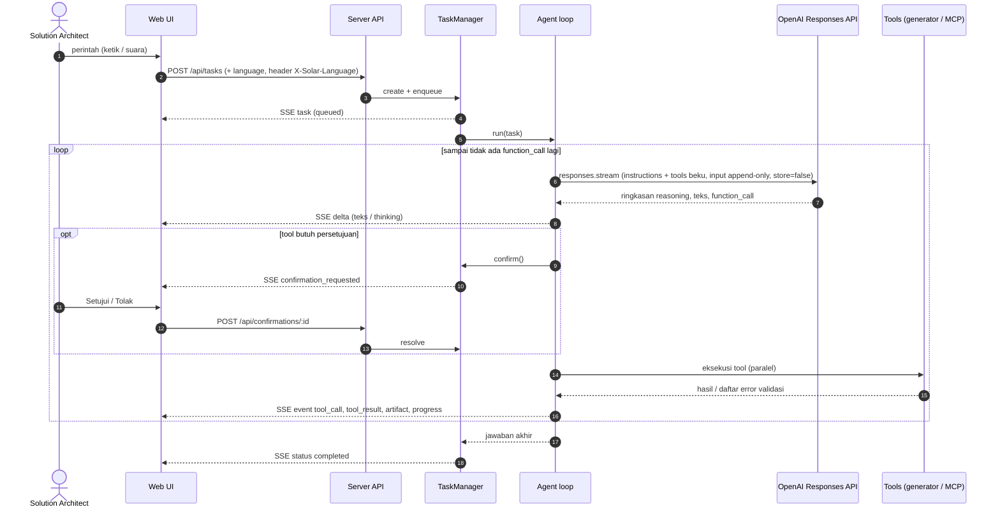

# Arsitektur SOLAR

Dokumen ini menjelaskan cara kerja internal SOLAR untuk pengembang dan reviewer.

## 1. Komponen

| Komponen | Lokasi | Tanggung jawab |
|---|---|---|
| Web UI | `apps/web` | React 19 + Vite + TypeScript. Karakter 3D yang bisa dipilih (`src/character/`: Robo (default), Mochi, Cocoa Kelapa, Kelinci; three.js, animasi GSAP), chat + komposer suara, monitor, pengaturan. Semua teks dalam Bahasa Indonesia dan English (`src/i18n/{id,en}/`, `src/lib/i18n.ts`, lihat bagian 9). Berkomunikasi lewat REST dan Server-Sent Events. PWA: `public/manifest.webmanifest`, service worker `pwa/`, ikon PNG (`public/icons/`, juga ikon installer `apps/desktop/build/icon.png`) yang dibuat dari `public/favicon.svg` oleh `scripts/generate-icons.mjs`. |
| Server | `apps/server` | Express 5. `TaskManager` (antrean, status, progres, konfirmasi), agent loop OpenAI, generator + validator, `SkillStore`, `PluginStore` + `McpManager`, penyimpanan. Pesan untuk manusia dalam dua bahasa (`src/i18n.ts` + katalog `src/i18n/*.ts`). |
| Desktop | `apps/desktop` | Electron 44. Memuat bundle server (`server.mjs`) di main process (pembacaan lampiran dan render Word berjalan di *worker thread* `extract-worker.mjs` / `docx-worker.mjs` yang ikut di resources), membuka jendela ke UI lokal, mengatur izin mikrofon, mode mini, `.env` di `%APPDATA%\SOLAR`. Menu & dialog ID/EN (`src/i18n.ts`) mengikuti bahasa UI. |
| Shared | `packages/shared` | Kontrak tipe antara server dan UI (`Task`, `TaskEvent`, `Artifact`, `PluginView`, `StreamMessage`, ...), termasuk `Language` (`'id' \| 'en'`), `LANGUAGES` dan `LANGUAGE_HEADER` (`X-Solar-Language`). |

## 2. Alur sebuah task ("sekali proses")

### Detail agent loop (`apps/server/src/agent/agent.ts`)

- **Provider**: OpenAI Responses API lewat SDK resmi `openai` (`client.responses.stream`). Kunci: `OPENAI_API_KEY`;
  opsional `OPENAI_ORG_ID`, `OPENAI_PROJECT_ID`, `OPENAI_BASE_URL`. Client dibuat saat task pertama sehingga server tetap
  bisa start (dan UI menampilkan petunjuk) walau key belum diisi.
- **Model**: `SOLAR_MODEL` (default `gpt-6.1-sol`), `reasoning: { effort: SOLAR_EFFORT, summary: "auto" }` untuk model
  reasoning (GPT-5/6, o-series); model non-reasoning (GPT-4.1/4o, `*-chat-latest`) dipanggil tanpa parameter `reasoning`.
  `max_output_tokens` = `SOLAR_MAX_TOKENS` (default 64 000, dibatasi maksimum model) dan dinaikkan sekali ke maksimum
  model bila respons `incomplete` - pemanggilan tool yang terpotong tidak pernah dijalankan.
- **Stateless & privasi**: `store: false` + `include: ["reasoning.encrypted_content"]` - tidak ada percakapan yang disimpan
  di OpenAI; item reasoning terenkripsi dikirim balik apa adanya sehingga penalaran model tetap utuh antar giliran.
- **Penolakan / filter**: konten `refusal` atau `incomplete_details.reason = "content_filter"` dilaporkan sebagai kegagalan
  task yang jelas. Error API dipetakan ke pesan dalam bahasa task, Indonesia atau English (key salah,
  `insufficient_quota`, rate limit, model tidak tersedia, koneksi, error 5xx provider).
- **Prompt caching**: otomatis di OpenAI untuk prefix ≥ 1024 token. `instructions` tidak berisi data volatil (tanggal, id
  task dan bahasa antarmuka ada di blok `<task_context>` pesan user pertama), daftar tool diurutkan deterministik, dan
  `prompt_cache_key: "solar-agent"` dipakai bersama oleh semua task. Token cache terlihat di monitor.
- **Input append-only**: `instructions` dan daftar tool dibekukan per task; semua item output (reasoning, pesan,
  `function_call`) dikirim kembali apa adanya diikuti `function_call_output`. Konteks percakapan sebelumnya (maks. 5 task
  dalam sesi yang sama) diringkas ke pesan pertama ("simple compaction"), sehingga tidak ada pengeditan riwayat.
- **Validasi input tool**: argumen `function_call` di-parse sebagai JSON lalu divalidasi skema zod; JSON rusak atau input
  tidak valid dikembalikan ke model sebagai `ERROR: …` agar diperbaiki di giliran berikutnya. Deskripsi tool MCP dipotong
  ke 1024 karakter (batas OpenAI).
- **Tool paralel**: `parallel_tool_calls: true`; semua `function_call` dalam satu giliran dieksekusi bersamaan.
- **Estimasi biaya**: tabel harga per model di `agent/models.ts` (termasuk tarif konteks panjang GPT-6 > 272K token);
  bisa ditimpa `SOLAR_PRICE_PER_MTOK`.
- **Batas**: `SOLAR_MAX_TURNS` giliran per task; pembatalan menghentikan stream dan menolak konfirmasi yang tertunda.

## 3. Generator & validator

| Generator | Validasi | Output |
|---|---|---|
| `generators/archimate` | Skema zod; tabel relasi ArchiMate 3.2 (`relationships.generated.ts`, dibuat dari `relationships.xml` proyek Archi via `scripts/generate-archimate-relationships.mjs`); id unik; referensi; junction (jenis relasi sama, ada masuk & keluar); view (elemen & relasi valid, kedua ujung relasi ada di view); peringatan elemen yatim/duplikat. | Exchange XML 3.1 (diuji dengan XSD resmi), SVG per view (layout per layer + urutan barycenter + routing kurva yang menghindari elemen), JSON. |
| `generators/sequence` | Participant unik & bukan kata kunci; pesan ke participant terdaftar; keseimbangan aktivasi; nesting fragment & cabang `else`; cabang tidak kosong. | Mermaid (escape entitas satu-langkah), PlantUML, SVG (layout kolom berbasis lebar label, aktivasi bertingkat, fragment bersarang), JSON. |
| `generators/techspec` | Skema zod; id FR/NFR/AD/INT/RSK/OI unik lintas bagian; referensi diagram harus SVG artefak task. | `document.ts` menyusun `BuiltDocument` netral-format (heading bernomor, tabel, daftar, gambar bernomor, kode); `render.ts` → Markdown GitHub (anchor kompatibel, tabel aman) dan HTML siap cetak (diagram inline, Markdown disanitasi); `docx.ts` → **Word .docx** (lihat 3c); JSON. Label `id`/`en` di `i18n.ts`. |

Jika validasi gagal, tool mengembalikan `is_error` berisi daftar error bernomor dan **tidak menyimpan apa pun**, sehingga
model memperbaiki input lalu memanggil ulang.

## 3b. Lampiran dokumen proyek

1. UI mengunggah file (tombol klip, seret-lepas, atau tempel) ke `POST /api/attachments` - isi file mentah, maks.
   `ATTACHMENT_MAX_MB`. `AttachmentService` memvalidasi nama & ekstensi lalu memanggil `documents/extractIsolated`.
2. **Isolasi:** `extractIsolated` menjalankan ekstraksi di *worker thread* (`dist/extract-worker.mjs`, ikut terpasang di
   aplikasi desktop) dengan maksimal 2 ekstraksi paralel, batas waktu keras (batas waktu parser 90 detik + 5 detik) dan
   batas memori ±1 GB: selain `resourceLimits` (hanya heap V8, dan bisa ditimpa `--max-old-space-size` di `NODE_OPTIONS`),
   server membaca `worker.getHeapStatistics()` setiap 50 ms dan menghentikan worker bila heap + memori eksternal
   (ArrayBuffer, mis. stream pdf.js) melewati batas. File patologis tidak bisa memblokir event loop atau menghabiskan memori
   server/Electron (satu alokasi buffer tunggal bisa sesaat melampauinya sebelum dihentikan). Saat dijalankan dari source
   (`npm run dev`, test) ekstraksi berjalan in-process; tes `documents.worker.test.ts` mem-bundle worker dan menguji jalur
   aslinya (kode error, status HTTP, timeout).
3. **Ekstraksi** (`apps/server/src/documents`) mengenali file dari **isinya** (`%PDF-` + objek PDF, paket ZIP Office,
   kontainer OLE2), bukan hanya ekstensi, lalu mengubahnya menjadi **Markdown** yang menjaga struktur. Semua pemindaian
   XML memakai tokenizer linear (`xml.ts`) atau regex yang tidak bisa mundur ke seluruh teks, sehingga markup rusak yang
   disengaja tidak membuat waktu baca kuadratik.
   - PDF: `unpdf` (pdf.js serverless) - baris disusun ulang dari geometri teks (arah teks diputar balik bila halaman
     diputar, teks miring/watermark ditandai, tumpukan teks *fake bold* digabung), penanda `<!-- page N -->`, heading dari
     peringkat ukuran huruf yang dominan per baris (paragraf berhuruf besar tidak dianggap heading), peringatan untuk
     halaman tanpa lapisan teks atau halaman gambar dengan sedikit teks stempel (tanpa OCR), halaman rusak dilewati,
     dan pemotongan karakter selalu pada batas halaman.
   - Word: `docxPrepare.ts` menyiapkan paket sebelum `mammoth` (DOM ±100-150 MB per MB XML): bagian utama dicari seperti
     mammoth, setiap bagian XML dibatasi ukurannya dan diperiksa *well-formed* secara linear, bagian utama dipotong di
     batas blok (atau paragraf) dalam anggaran ±4 MB, catatan kaki/akhir dipotong per catatan, komentar disembunyikan,
     referensi relasi/catatan yang menggantung dibuang, dan penomoran Word (`numbering.xml`, termasuk heading bernomor
     dan daftar yang berlanjut) ditulis ke teks. Lalu `mammoth` (docx → HTML) + `turndown` (HTML → Markdown) dengan
     aturan tabel (colspan/rowspan), daftar, catatan kaki dan gambar; HTML dibagi per elemen (daftar panjang per 300 item,
     tabel tata letak dibuka, tabel besar per 400 baris di titik tanpa sel gabungan yang berlanjut) agar turndown tetap
     linear.
   - Excel: pembaca streaming sendiri - hanya baris yang ditampilkan yang di-parse (maks. 50 sheet, 1.000 baris ×
     50 kolom per sheet, jumlah baris sebenarnya dilaporkan walau `<dimension>` basi), tanggal/durasi (`[h]:mm`)/persen
     sesuai format sel dan pembulatan Excel, nilai rumus tersimpan, shared strings dibaca sampai indeks tertinggi yang
     dipakai, anggaran karakter ditegakkan saat merender. Hasilnya `## Sheet: nama` + tabel.
   - PowerPoint: parser XML kecil sendiri (tanpa ekspansi entitas, kedalaman dibatasi) - slide sesuai urutan
     `sldIdLst`, `## Slide N: judul`, poin bertingkat, tabel (maks. 1.000 × 50), data grafik (judul grafik, maks. 50 seri),
     SmartArt, deskripsi gambar, `### Speaker notes`.
   - CSV menjadi satu tabel di bawah `# <nama file>` (maks. 2.000 baris; pemisah ditebak dari konsistensi beberapa baris
     pertama, `sep=` dihormati, baris judul menjadi keterangan); Markdown/teks dibaca apa adanya. Teks dideteksi sebagai
     UTF-8 (byte asing sesekali diganti), UTF-16 (dengan/tanpa BOM), selain itu Windows-1252 (ekspor ANSI); file biner
     berekstensi teks ditolak.
   - Setiap bagian paket Office dibaca lewat `ZipArchive` yang membatasi byte yang **benar-benar** didekompresi (ukuran
     yang dinyatakan, ukuran aktual, total 256 MB, 10.000 entri, rasio kompresi > 200:1 untuk bagian > 8 MB) sehingga
     *zip bomb* - termasuk yang header-nya berbohong - ditolak sebelum memakan memori. Kontainer OLE2 dibaca dengan batas
     ukuran file (tanpa membangun tabel FAT penuh) dan hanya stream di root yang dipakai untuk menentukan jenisnya.
   - Error membawa kode (`EMPTY`, `TOO_LARGE`, `ZIP_BOMB`, `ENCRYPTED`, `CORRUPT`, `LEGACY_FORMAT`, `UNSUPPORTED`,
     `TIMEOUT`) → HTTP 413/415/422 dengan pesan dalam bahasa permintaan (Indonesia/English), mis. dokumen terenkripsi
     atau `.doc` lama yang diberi ekstensi `.docx`. Hasil dibatasi 2 juta karakter dan sel tabel 2.000 karakter; setiap
     pemotongan disebutkan sebagai peringatan (ditulis dalam bahasa unggahan dan disimpan di `Attachment.warnings`).
4. File asli dan hasil ekstraksi disimpan di object store (`attachments/<id>/…`), metadata (`Attachment`) di repository
   (`solar_attachments` / `data/attachments/*.json`). UI menampilkan chip + pratinjau teks hasil ekstraksi.
5. `POST /api/tasks` membawa `attachmentIds` (harus satu percakapan; validasi + pembuatan task berjalan di bawah kunci
   per percakapan sehingga lampiran tidak bisa terhapus di tengahnya). Pesan pertama ke model berisi blok
   `<attached_documents>`: teks lengkap bila total ≤ 60.000 karakter, selain itu daftar + outline dan strategi baca.
6. Tool agent: `list_documents`, `read_document` (potongan berdasarkan offset, lanjut dengan `next_offset`; anggaran
   ±400.000 karakter per task karena setiap bacaan tetap ada di input model), `search_documents` (frasa, lalu semua
   kata; semua dokumen dicari secara bergiliran; mengembalikan lokasi halaman/slide/sheet terdekat). Agen hanya melihat
   dokumen yang benar-benar dikirim bersama permintaan (task ini atau task sebelumnya di percakapan yang sama).
7. Dokumen yang diunggah tetapi belum dikirim muncul lagi sebagai chip setelah reload, dan dihapus otomatis setelah 24 jam.
8. Prompt-injection: isi dokumen dibingkai sebagai data dari pengguna; tag pembingkai SOLAR di dalam teks dokumen
   dinetralkan; system prompt dan deskripsi tool melarang mengikuti instruksi di dalam dokumen. Aksi eksternal tetap tunduk
   pada aturan konfirmasi plugin.

## 3c. Dokumen Word (.docx) TSD

- `create_technical_specification` menyimpan `.md` dan `.html`, lalu `<nama>.docx` (`kind: tsd-docx`, judul
  "<judul> (Word)"), lalu `.tsd.json`, semuanya di paket yang sama dan dengan nama dasar `.md` yang tersimpan (bila task
  sudah punya `x.md`, keempat file menjadi `x-2.*`). File Word disimpan **sebelum** `.tsd.json` dan keduanya di dalam
  antrean per paket (`withTechSpecBundleLock`), karena UI menawarkan **Buat Word** untuk paket yang punya `.tsd.json` tanpa
  .docx: ekspor yang datang selama tool merender menunggu lalu mendapat file milik tool, sehingga paket tidak pernah punya
  dua file Word. Bila Word gagal dibuat, TSD tetap tersimpan dengan peringatan `[docx]` dan hasil tool `docx: null`; file
  Word bisa dibuat belakangan.
- `generators/techspec/docx.ts` (`renderTechSpecDocx`, pustaka `docx`) merender `BuiltDocument` yang sama dengan
  Markdown/HTML: sampul, kontrol dokumen (tanggal panjang seperti di sampul, satu nama per baris), riwayat revisi, lembar
  persetujuan (reviewer/penyetuju), daftar isi berupa field `TOC` sungguhan, bagian bernomor, header/footer "Halaman X dari
  Y", A4, bahasa proofing `id-ID`/`en-US` (kode tidak diperiksa ejaannya). Semua memakai style bernama Word (Title,
  Heading N, Caption, TOC, Table Grid, ...) agar bisa diganti template klien; heading Markdown di dalam teks menjadi
  Heading 3 ke bawah (`###` Heading 3, `####` Heading 4) dan tidak masuk daftar isi. Bookmark heading `_Tsd_<anchor>`
  (aman untuk Word) menjadi target tautan `#anchor` dari Markdown; tautan eksternal di-encode sebagai URI yang valid.
- **Nomor halaman daftar isi** dihitung saat dibuat dengan `docx/layout` (tata letak halaman mirip Word) dan ditulis ke
  file, jadi daftar isi lengkap saat dibuka tanpa dialog "update fields". Nomor itu **perkiraan**: pada dokumen panjang
  sebuah heading bisa meleset satu halaman (di tempat tabel/blok pas-pasan di dasar halaman) sampai pengguna menekan
  *Update Table*; nomor di footer selalu tepat (field PAGE/NUMPAGES). Bila tata letak gagal, atau dokumen terlalu mahal
  untuk ditata (`layoutAffordable`: token tak terputus > 400 karakter atau > 400.000 karakter teks), file ditulis dengan
  `updateFields` sehingga Word mengisi nomornya saat dibuka.
- **Tata letak isi.** Lebar kolom tabel diukur dengan lebar karakter Calibri; bila sempit, ruang diambil dari kolom
  prosa lebih dulu sehingga id, kode dan kata pendek tidak terpotong di tengah. Tabel dokumen yang kata-katanya tetap tidak
  muat di A4 tegak (mis. identifier panjang) mendapat halaman **lanskap** bersama heading tepat sebelumnya. Label yang
  memperkenalkan kode/daftar/tabel ("Contoh Response:") selalu satu halaman dengan isinya (*keep with next*).
- Diagram ditanam sebagai **SVG + cadangan PNG**. `generators/svgRaster.ts` merasterisasi SVG dengan
  `@resvg/resvg-wasm` (2× ukuran tampil, maks. 4000 px per sisi dan 8 MP; wasm dimuat sekali walau dipanggil
  bersamaan) memakai font Liberation Sans yang ikut dibawa, sehingga teks diagram tetap tergambar tanpa font sistem.
  Warna `rgba()` diubah menjadi hex + opacity untuk renderer SVG Office; bila rasterisasi gagal, gambar pengganti abu-abu
  + peringatan. Diagram lebar yang tampil ≥ 1,2× lebih besar di halaman lanskap mendapat **section lanskap** sendiri
  (bersama heading tepat sebelumnya dan catatan sumber Mermaid-nya; header/footer selebar halaman). Bila teks diagram
  tetap tercetak < 5 pt, hasil render memberi peringatan agar view dipecah.
- **Worker thread.** Render Word (tata letak halaman beberapa detik untuk TSD panjang, rasterisasi diagram) tidak pernah
  berjalan di thread server - di aplikasi desktop itu main process Electron. `tasks/techSpecDocxIsolated.ts`
  (`renderTechSpecDocxIsolated`, dipakai tool dan route) menjalankan setiap render di *worker thread* baru dari
  `dist/docx-worker.mjs` (entry `src/tasks/techSpecDocxWorker.ts`): maks. 2 render paralel, heap maks. 1 GB, hasil
  dipindahkan (transfer) ke thread server tanpa disalin. Batas waktu 30 detik dengan tata letak halaman; bila lewat, render
  diulang tanpa tata letak (30 detik lagi) dengan peringatan bahwa Word mengisi nomor daftar isi saat dibuka; bila itu
  juga lewat, render gagal dengan pesan yang jelas (tool: peringatan `[docx]`; route: `500`). Biaya: ±0,3-0,5 detik per
  ekspor untuk memulai worker; render TSD contoh ±1-2 detik, sementara server tetap menjawab permintaan lain. Dari source
  (`npm run dev`, vitest) file worker tidak ada di sebelah kode, jadi render berjalan in-process; tes
  `techspec.docx.worker.test.ts` mem-bundle worker dengan plugin build yang sama dan menguji jalur aslinya (PNG, event
  loop, kedua timeout).
- `tasks/techSpecDocx.ts` dipakai bersama oleh tool dan `POST /api/artifacts/:id/docx` (TSD lama tanpa .docx): model
  dibaca dari `.tsd.json` paket, divalidasi ulang, diagram dicari di antara artefak SVG task, tanggal dokumen = tanggal
  TSD dibuat. Satu antrean per paket (klik ganda tidak membuat dua file); paket yang sudah punya .docx mengembalikan file
  itu (`200`). File baru disimpan lewat `TaskManager.addArtifact`, yang memancarkan event `artifact` yang sama dengan
  artefak buatan agent, sehingga UI yang terbuka langsung menampilkannya.
- Web UI: file Word tidak dipratinjau sebagai teks; dialognya menawarkan unduhan dan pratinjau versi HTML paket yang
  sama. Kelompok TSD menampilkan tombol **Unduh Word (.docx)**, atau **Buat Word (.docx)** untuk TSD lama - tidak selama
  task masih berjalan. Tombol tetap fokus selama proses (`aria-disabled`, klik/Enter tambahan tidak mengirim permintaan
  kedua), fokus pindah ke **Unduh Word** setelah berhasil, error tampil di `role="alert"` dalam bahasa antarmuka (pesan
  server, juga dalam bahasa itu, di bawah "Rincian").

**Aset biner dan bundle.** Aplikasi desktop dan paket self-host hanya membawa file bundle (`dist/index.js` atau
`dist/server.mjs`, `dist/extract-worker.mjs`, `dist/docx-worker.mjs`, tanpa `node_modules`), jadi aset ikut di-embed:
`src/assets/assets.json` mendaftar wasm resvg (path paket npm) dan dua font (`apps/server/assets/fonts`, path file). Dari
source (tsx, vitest) `loadAsset()` membacanya dari disk. Saat `build.mjs` mem-bundle, plugin esbuild `solar-embed-assets`
(`build-plugins.mjs`) mengganti `src/assets/embedded.ts`: di `docx-worker.mjs` (±7 MB) dengan modul berisi base64
setiap file (di-decode saat pertama dipakai; base64-nya dibuang dari source map), di bundle lain dengan modul kosong yang
membuat `loadAsset()` gagal dengan pesan jelas alih-alih mencari file di disk. Plugin `solar-word-renderer-in-worker-only`
membuang fallback in-process dari `index.js`/`server.mjs`, sehingga pustaka `docx`, resvg dan font sama sekali tidak ada
di bundle server; tanpa `docx-worker.mjs` di sebelahnya, render gagal dengan pesan "the Word renderer (docx-worker.mjs) is
missing next to the server bundle" dan server tetap berjalan. `build.mjs` gagal bila bundle server memuat renderer Word,
dan memeriksa `docx-worker.mjs` dengan menjalankannya sendirian dari folder sementara (diagram harus tergambar dari aset
yang di-embed, tanpa peringatan). `apps/desktop/package.json` (`extraResources`) dan `scripts/pack-server.mjs` ikut
membawa `docx-worker.mjs`. Lisensi: `docx` (MIT, beserta paket yang sudah ada di dalam build-nya), resvg-wasm (MPL-2.0,
beserta crate Rust di dalam wasm-nya), Liberation Sans (SIL OFL 1.1) - lihat `THIRD_PARTY_NOTICES.md`.

## 4. Konfirmasi (human-in-the-loop)

- Setiap tool punya fungsi `confirmation(input, lang)` yang menulis alasan dalam bahasa task; plugin MCP mengikuti
  kebijakan `never | writes | always` (`writes` memakai anotasi MCP `readOnlyHint`/`destructiveHint` bila ada, selain heuristik nama tool).
- `TaskManager.requestConfirmation` menyimpan `Confirmation`, mengubah status task menjadi `awaiting_confirmation`,
  memancarkan event, lalu menunggu jawaban, pembatalan, atau timeout (`CONFIRMATION_TIMEOUT_MINUTES`).
- Penolakan dikembalikan ke model sebagai `tool_result` error dengan instruksi untuk tidak mengulang.

## 5. Penyimpanan

| Data | Tanpa konfigurasi | Dengan konfigurasi |
|---|---|---|
| Task, event timeline, metadata artefak, konfirmasi, metadata lampiran | `data/tasks/*.json` + `*.events.jsonl`, `data/attachments/*.json` | Neon Postgres (`DATABASE_URL`): tabel `solar_tasks`, `solar_task_events`, `solar_artifacts`, `solar_confirmations`, `solar_attachments` (dibuat/dimigrasi otomatis; mis. kolom `solar_tasks.language` ditambahkan dengan `ADD COLUMN IF NOT EXISTS … DEFAULT 'id'`). |
| File artefak & lampiran | `data/artifacts/tasks/<task>/<artifact>/<file>`, `data/artifacts/attachments/<id>/…` | Object storage S3-compatible (`S3_*`) dengan prefix `S3_PREFIX`. |
| Skill pengguna, plugin, status skill | `data/skills/`, `data/plugins.json`, `data/skills-state.json` | sama |

Saat server mulai, task yang tertinggal berstatus aktif dari proses sebelumnya ditandai gagal ("server di-restart").

## 6. Realtime ke UI

`GET /api/stream` (SSE) mengirim `StreamMessage`:

- `task` - snapshot task setiap perubahan (status, progres, langkah, usage).
- `event` - event timeline yang tersimpan (status, progress, thinking, text, tool_call, tool_result, confirmation_*, artifact, usage, log, result, error).
- `delta` - potongan teks/thinking yang sedang di-stream (tidak disimpan).
- `plugins` - status koneksi plugin MCP, dalam bahasa koneksi stream itu (`?lang=`).

EventSource tidak bisa mengirim header, jadi web UI membuka `/api/stream?lang=<bahasa>` dan membuka ulang stream saat
bahasa antarmuka diganti (task dan event dimuat ulang setelahnya, seperti setelah koneksi terputus). Teks di `task` dan
`event` tidak bergantung pada koneksi: ditulis dalam bahasa task. UI menggabungkan delta per frame animasi
(requestAnimationFrame) agar tetap ringan.

## 7. Karakter 3D (bisa dipilih)

`src/character/` memisahkan **mesin animasi** dari **model karakter**:

- `rig.ts` - kontrak `Rig` yang wajib disediakan setiap model: grup `body` (squash & stretch), `head` (mengikuti kursor,
  memuat wajah), `earL/earR` (antena Robo, telinga kelinci, daun sakura Mochi, payung & sedotan Cocoa Kelapa), `armL/armR` (berporos di
  bahu), mata, mulut, pipi, tablet, titik jangkar lencana "?"/"!" dan kotak bingkai kamera, plus nilai pose istirahat
  (tinggi kepala, sudut telinga/lengan, kelenturan telinga, amplitudo napas). `Kit` berisi pembuat bagian bersama
  (mata, kacamata, pipi, mulut, tablet, dekorasi di permukaan elipsoid).
- `models/robot.ts`, `models/mochi.ts`, `models/cocoa.ts`, `models/rabbit.ts` - geometri prosedural three.js (tanpa aset
  eksternal) dengan material toon. **Robo** (default) adalah robot putih-biru berkepala layar: mata, mulut dan pipi
  bercahaya di layar wajah gelap, inti matahari bercahaya di dada; dua antenanya yang berujung lampu kuning adalah
  `earL/earR` rig, jadi menegak, bergoyang dan terkulai seperti telinga karakter lain. Pada Mochi dan Cocoa Kelapa
  tubuh bulatnya adalah `head`, sehingga wajah tetap menempel saat menoleh.
- `CharacterScene.ts` - lampu, bayangan, cincin mendengarkan, titik berpikir, lencana, interaksi (hover/klik), framing
  kamera dari `rig.frame`, dan satu set timeline GSAP untuk semua karakter (nilai pose relatif terhadap pose istirahat
  rig). three.js hanya merender.
- `characters.ts` - daftar karakter (`DEFAULT_CHARACTER = 'robot'`, Robo), preferensi `solar.character` di `localStorage` dan event
  `solar:character`; `CharacterStage` membuat ulang scene saat karakter diganti dan langsung memakai state saat itu.
  Pemilih ada di panggung (`CharacterSwitcher`) dan di *Pengaturan → Karakter* (`CharacterCards`).

State diturunkan di `AgentPage`: `listening` (mikrofon aktif) → `happy`/`sad` (2 detik setelah task selesai/gagal) →
`asking` (menunggu persetujuan) → `working` (ada pemanggilan tool yang belum selesai) / `thinking` → `talking` (TTS) →
`idle`. Animasi dikurangi bila pengguna mengaktifkan *prefers-reduced-motion*; bila WebGL tidak tersedia, ilustrasi SVG
karakter (`public/characters/*.svg`) ditampilkan.

## 8. Suara

- **Web Speech API** (Chrome/Edge di browser) untuk pengenalan suara realtime dengan hasil sementara.
- **Whisper lokal** (`voice/whisper.worker.ts`): transformers.js dimuat dari CDN pada pemakaian pertama, model
  (`Xenova/whisper-small` default) di-cache browser; audio direkam dengan MediaRecorder, berhenti otomatis setelah ±1,5 detik
  hening, di-resample ke 16 kHz, ditranskripsi di Web Worker. Dipakai otomatis di Electron.
- **TTS**: `speechSynthesis` dengan suara sistem sesuai bahasa.
- **Bahasa suara** (`VoicePrefs.lang`, `localStorage` `solar.voice`): `'auto'` (default) memakai `id-ID`/`en-US` sesuai
  bahasa antarmuka, untuk pengenalan suara dan TTS; `'id-ID'`/`'en-US'` eksplisit tetap. Preferensi disimpan dengan
  `v: 2`; nilai lama tanpa `v` yang berisi default lama `'id-ID'` dibaca sebagai `'auto'`, `'en-US'` lama tetap.

## 9. Bahasa (Indonesia / English)

Seluruh aplikasi bisa dipakai dalam Bahasa Indonesia (`id`) atau English (`en`) dan bahasanya bisa diganti kapan saja.
Tipe bersama: `Language`, `LANGUAGES`, `LANGUAGE_HEADER` (`X-Solar-Language`) dan `Task.language` di `packages/shared`.

**Web UI** (`apps/web/src/lib/i18n.ts`)

- Kamus per namespace di `src/i18n/{id,en}/<namespace>.ts` (common, app, agent, character, monitor, artifacts,
  settings, voice, api). File Indonesia adalah sumber tipe (`Dict = typeof id`); file English bertipe `Dict['<ns>']`,
  jadi key yang hilang/berlebih adalah error kompilasi. Parameter dan bentuk jamak English memakai fungsi
  (`i18n/helpers.ts`); komponen tidak pernah merangkai potongan terjemahan.
- Komponen memakai `useT()` / `useLang()` (store kecil berbasis `useSyncExternalStore`, seperti `lib/pwa.ts`), modul
  biasa memakai `t()` saat teksnya dibutuhkan dan `subscribeLang()` untuk hal yang dibuat sekali (mis. `aria-label`
  canvas karakter). Tanggal, angka, ukuran dan durasi diformat per bahasa di `lib/format.ts` (`localeOf()` →
  `id-ID`/`en-US`).
- **Bahasa awal** bila pengguna belum memilih: bahasa pertama dari `navigator.languages` yang dikenali (`id`/`ms` →
  `id`, `en` → `en`), selain itu `id`. Pilihan disimpan lewat `writePref` (`localStorage` `solar.lang`, JSON) dan
  diikuti jendela lain lewat event `storage`; selama belum memilih, event `languagechange` browser juga diikuti.
- Script inline di `index.html` (seperti script tema, aturan yang sama dengan `detectLang`) membaca `solar.lang` /
  `navigator.languages` dan mengatur `<html lang>` dan link manifest sebelum tampilan pertama; saat aplikasi dimuat dan
  setiap pergantian, `lib/i18n.ts` memperbarui keduanya plus `<meta name="description">`. Manifest PWA bergantian antara
  `manifest.webmanifest` (id) dan `manifest.en.webmanifest` (en).
- Ke server: header `X-Solar-Language` di setiap request `fetch`, `language` di body `POST /api/tasks`, dan
  `?lang=` di URL yang dibuka browser sendiri (`/api/stream`, ZIP, unduhan artefak dan lampiran). Stream dibuka ulang
  saat bahasa diganti. Error jaringan (`fetch` gagal) ditampilkan sebagai pesan "server tidak bisa dihubungi" dalam
  bahasa antarmuka.
- Tombol cepat di bawah karakter berisi template perintah dalam bahasa antarmuka, sehingga agent menjawab dalam bahasa
  yang sama.

**Server** (`apps/server/src/i18n.ts`)

- Katalog per area di `src/i18n/` (`tasks`, `api`, `documents`, `knowledge`, `llm`), setiap entri berisi kedua bahasa
  berdampingan; `t(lang, key, params)` bertipe (key harus ada, placeholder `{name}` harus cocok). `both(key)` membuat
  teks dua bahasa untuk nilai yang ditampilkan nanti; `LocalizedError` membawa pesan dua bahasa (`message` = `id` untuk
  log, test dan agent) dan dijawab dalam bahasa permintaan oleh handler error. Nama tool (`AgentTool.displayName`)
  bertipe `LocalizedText` (`{ id, en }` atau satu string untuk tool MCP). Pesan validasi zod diterjemahkan oleh
  `formatZodIssues`; pesan khusus skema ditulis dengan `schemaMessage()` agar ikut diterjemahkan.
- **Lingkup task**: teks yang tersimpan bersama task dan dikirim lewat SSE ke semua klien (`currentStep`, pesan
  `status`, `displayName` tool, `summary` hasil tool, alasan konfirmasi, error agent, `Confirmation.displayName`)
  ditulis dalam `Task.language` (`taskLang(ctx)`), yang ditetapkan sekali saat task dibuat dari bahasa klien.
- **Lingkup permintaan**: error route, error & peringatan lampiran (disimpan di `Attachment.warnings` dalam bahasa
  unggahan), hasil impor knowledge, tes koneksi provider, status plugin di `/stream` dan README ZIP mengikuti
  `requestLanguage()`: header `X-Solar-Language`, lalu query `lang`, lalu `Accept-Language`, lalu `id`.
  `languageMiddleware` menyimpannya di `req.lang`; handler error (yang bisa jalan sebelum middleware) memakai `langOf(req)`.
- Tanpa bahasa apa pun server tetap berbahasa Indonesia (`DEFAULT_LANG = 'id'`), sehingga klien lama, task lama
  (`language` kosong dibaca sebagai `id` oleh kedua repository) dan test lama tidak berubah. Test bahasa English ada
  di `apps/server/test/i18n.test.ts` (katalog: placeholder kedua bahasa sama; route, upload, task, agent, LLM, MCP).
- Tidak diterjemahkan: data (isi knowledge & skill, deskripsi plugin dari konfigurasi, isi artefak, teks pengguna) dan
  deskripsi tool untuk model (English).

**Agent**

- System prompt tetap sama untuk semua task (cache tetap stabil): aturannya, jawab dalam bahasa tulisan permintaan;
  bila tidak jelas, pakai bahasa antarmuka di `<task_context>` (`Interface language: English` / `Bahasa Indonesia`)
  pesan user pertama.
- `create_technical_specification` tanpa `language` menulis TSD dalam bahasa task (default skema TSD sendiri tetap
  `id`); agent mengisi `language` bila permintaan meminta bahasa lain.

**Desktop** (`apps/desktop/src/i18n.ts`, `main.ts`, `preload.ts`)

- Menu dan dialog (sambutan pertama kali, gagal start) dalam dua bahasa. Saat start bahasa dibaca dari
  `<userData>/language.json` (`%APPDATA%\SOLAR\language.json`), selain itu dari `app.getLocale()` (`en…` → `en`, lainnya
  `id`).
- Preload menambahkan `solarDesktop.setLanguage(lang)`; web UI memanggilnya saat start dan setiap pergantian bahasa.
  Main process (IPC `solar:set-language`) hanya menerima pesan dari origin UI SOLAR sendiri, menyimpan bahasanya ke
  `language.json` dan membangun ulang menu.
- Installer NSIS: `multiLanguageInstaller` dengan `installerLanguages: ["en_US", "id_ID"]` - installer tampil dalam
  bahasa Windows bila Indonesia, selain itu English.
