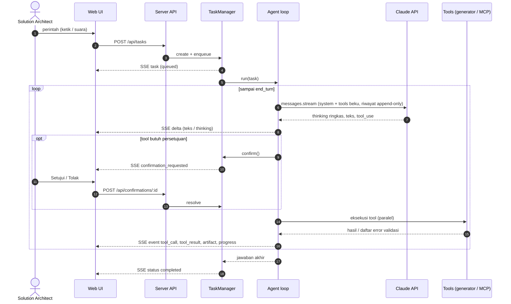

# Arsitektur SOLAR

Dokumen ini menjelaskan cara kerja internal SOLAR untuk pengembang dan reviewer.

## 1. Komponen

| Komponen | Lokasi | Tanggung jawab |
|---|---|---|
| Web UI | `apps/web` | React 19 + Vite + TypeScript. Kelinci 3D (`src/rabbit/RabbitScene.ts`, three.js, animasi GSAP), chat + komposer suara, monitor, pengaturan. Berkomunikasi lewat REST dan Server-Sent Events. |
| Server | `apps/server` | Express 5. `TaskManager` (antrean, status, progres, konfirmasi), agent loop Claude, generator + validator, `SkillStore`, `PluginStore` + `McpManager`, penyimpanan. |
| Desktop | `apps/desktop` | Electron 44. Memuat bundle server (`server.mjs`) di main process, membuka jendela ke UI lokal, mengatur izin mikrofon, mode mini, `.env` di `%APPDATA%\SOLAR`. |
| Shared | `packages/shared` | Kontrak tipe antara server dan UI (`Task`, `TaskEvent`, `Artifact`, `PluginView`, `StreamMessage`, ...). |

## 2. Alur sebuah task ("sekali proses")

### Detail agent loop (`apps/server/src/agent/agent.ts`)

- **Model**: `SOLAR_MODEL` (default `claude-opus-5-5`), `thinking: { type: "adaptive", display: "summarized" }`,
  `output_config.effort` = `SOLAR_EFFORT`, streaming dengan `max_tokens` 64 000 (dinaikkan ke 128 000 sekali bila sebuah
  pemanggilan tool terpotong).
- **Refusal fallback**: beta `server-side-fallback-2026-07-01` + `fallbacks: "default"` (dapat dimatikan dengan
  `SOLAR_REFUSAL_FALLBACK=false`). `stop_reason: "refusal"` dilaporkan sebagai kegagalan task yang jelas.
- **Prompt caching**: system prompt tidak berisi data volatil (tanggal & id task ada di pesan user pertama), daftar tool
  diurutkan deterministik, `cache_control` otomatis di level request.
- **Riwayat append-only**: system prompt dan daftar tool dibekukan per task; respons asisten (termasuk blok thinking) dikirim
  kembali apa adanya. Konteks percakapan sebelumnya (maks. 5 task dalam sesi yang sama) diringkas ke pesan pertama
  ("simple compaction"), sehingga tidak ada pengeditan riwayat.
- **Eager input streaming** untuk tool bawaan berinput besar (model ArchiMate, TSD); setiap input divalidasi skema zod
  sebelum dijalankan. Input yang tidak bisa di-parse menyebabkan giliran diulang (maks. 2 kali).
- **Tool paralel**: semua `tool_use` dalam satu giliran dieksekusi bersamaan dan seluruh `tool_result` dikirim dalam satu
  pesan user.
- **Batas**: `SOLAR_MAX_TURNS` giliran per task; pembatalan menghentikan stream dan menolak konfirmasi yang tertunda.

## 3. Generator & validator

| Generator | Validasi | Output |
|---|---|---|
| `generators/archimate` | Skema zod; tabel relasi ArchiMate 3.2 (`relationships.generated.ts`, dibuat dari `relationships.xml` proyek Archi via `scripts/generate-archimate-relationships.mjs`); id unik; referensi; junction (jenis relasi sama, ada masuk & keluar); view (elemen & relasi valid, kedua ujung relasi ada di view); peringatan elemen yatim/duplikat. | Exchange XML 3.1 (diuji dengan XSD resmi), SVG per view (layout per layer + urutan barycenter + routing kurva yang menghindari elemen), JSON. |
| `generators/sequence` | Participant unik & bukan kata kunci; pesan ke participant terdaftar; keseimbangan aktivasi; nesting fragment & cabang `else`; cabang tidak kosong. | Mermaid (escape entitas satu-langkah), PlantUML, SVG (layout kolom berbasis lebar label, aktivasi bertingkat, fragment bersarang), JSON. |
| `generators/techspec` | Skema zod; id FR/NFR/AD/INT/RSK/OI unik lintas bagian; referensi diagram harus SVG artefak task. | Markdown GitHub (anchor kompatibel, tabel aman), HTML siap cetak (diagram inline, Markdown disanitasi), JSON. |

Jika validasi gagal, tool mengembalikan `is_error` berisi daftar error bernomor dan **tidak menyimpan apa pun**, sehingga
model memperbaiki input lalu memanggil ulang.

## 4. Konfirmasi (human-in-the-loop)

- Setiap tool punya fungsi `confirmation(input)`; plugin MCP mengikuti kebijakan `never | writes | always`
  (`writes` memakai anotasi MCP `readOnlyHint`/`destructiveHint` bila ada, selain heuristik nama tool).
- `TaskManager.requestConfirmation` menyimpan `Confirmation`, mengubah status task menjadi `awaiting_confirmation`,
  memancarkan event, lalu menunggu jawaban, pembatalan, atau timeout (`CONFIRMATION_TIMEOUT_MINUTES`).
- Penolakan dikembalikan ke model sebagai `tool_result` error dengan instruksi untuk tidak mengulang.

## 5. Penyimpanan

| Data | Tanpa konfigurasi | Dengan konfigurasi |
|---|---|---|
| Task, event timeline, metadata artefak, konfirmasi | `data/tasks/*.json` + `*.events.jsonl` | Neon Postgres (`DATABASE_URL`): tabel `solar_tasks`, `solar_task_events`, `solar_artifacts`, `solar_confirmations` (dibuat otomatis). |
| File artefak | `data/artifacts/tasks/<task>/<artifact>/<file>` | Object storage S3-compatible (`S3_*`) dengan prefix `S3_PREFIX`. |
| Skill pengguna, plugin, status skill | `data/skills/`, `data/plugins.json`, `data/skills-state.json` | sama |

Saat server mulai, task yang tertinggal berstatus aktif dari proses sebelumnya ditandai gagal ("server di-restart").

## 6. Realtime ke UI

`GET /api/stream` (SSE) mengirim `StreamMessage`:

- `task` - snapshot task setiap perubahan (status, progres, langkah, usage).
- `event` - event timeline yang tersimpan (status, progress, thinking, text, tool_call, tool_result, confirmation_*, artifact, usage, log, result, error).
- `delta` - potongan teks/thinking yang sedang di-stream (tidak disimpan).
- `plugins` - status koneksi plugin MCP.

UI menggabungkan delta per frame animasi (requestAnimationFrame) agar tetap ringan.

## 7. Kelinci 3D

`RabbitScene` membangun karakter dari primitif three.js (tanpa aset eksternal) dengan material toon. Setiap state adalah
timeline GSAP pada properti `Object3D`; three.js hanya merender. State diturunkan di `AgentPage`:
`listening` (mikrofon aktif) → `happy`/`sad` (2 detik setelah task selesai/gagal) → `asking` (menunggu persetujuan) →
`working` (ada pemanggilan tool yang belum selesai) / `thinking` → `talking` (TTS) → `idle`.
Animasi dikurangi bila pengguna mengaktifkan *prefers-reduced-motion*; bila WebGL tidak tersedia, ikon statis ditampilkan.

## 8. Suara

- **Web Speech API** (Chrome/Edge di browser) untuk pengenalan suara realtime dengan hasil sementara.
- **Whisper lokal** (`voice/whisper.worker.ts`): transformers.js dimuat dari CDN pada pemakaian pertama, model
  (`Xenova/whisper-small` default) di-cache browser; audio direkam dengan MediaRecorder, berhenti otomatis setelah ±1,5 detik
  hening, di-resample ke 16 kHz, ditranskripsi di Web Worker. Dipakai otomatis di Electron.
- **TTS**: `speechSynthesis` dengan suara sistem sesuai bahasa.
