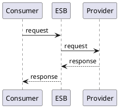

# Nama pola integrasi

## Kapan dipakai / kapan tidak boleh dipakai

## Sistem yang mendukung

## Alur standar (PlantUML)

## Aturan teknis
- Format pesan, header wajib, timeout, retry, idempotency, monitoring.

## Notasi ArchiMate
- Elemen dan relasi yang dipakai untuk pola ini.

## Contoh
